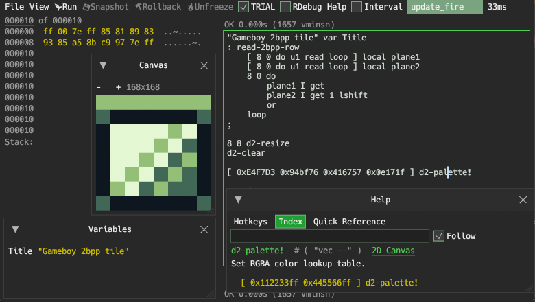
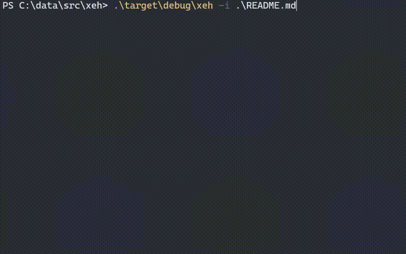
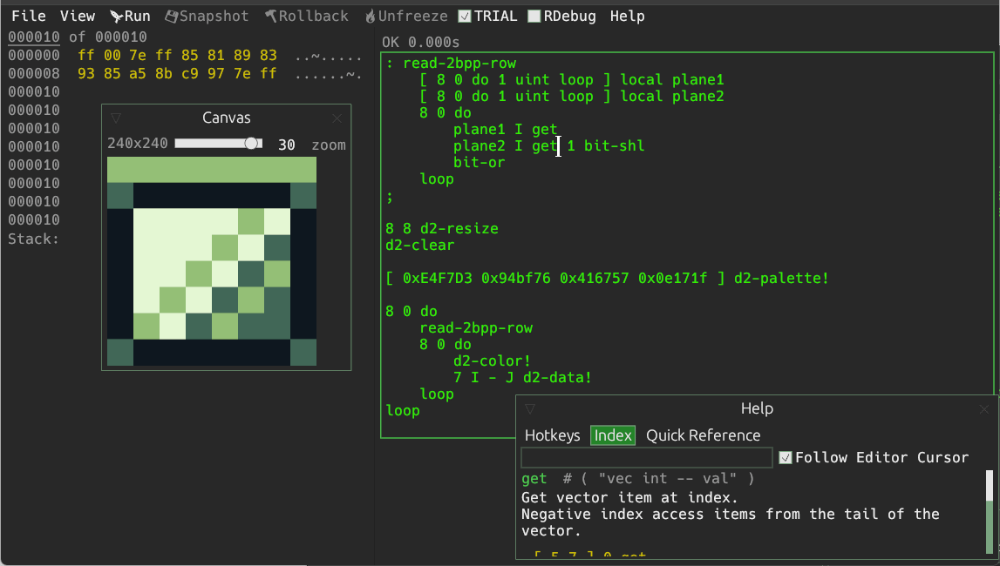
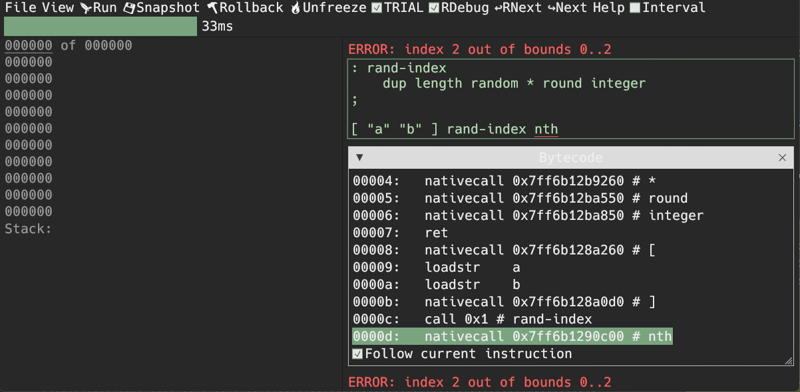
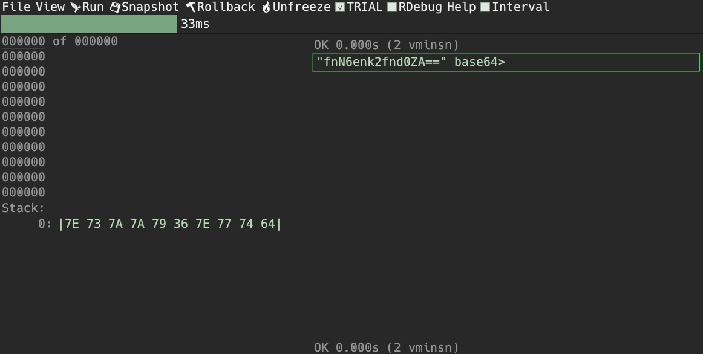

`cargo run --release`

On Linux you need to first run:

`sudo apt-get install libxcb-render0-dev libxcb-shape0-dev libxcb-xfixes0-dev libxkbcommon-dev libssl-dev`

## Collaborative Coding

This project supports networked collaborative coding. To use it:

1.  Start the broadcast server:
    ```bash
    pip install websockets
    python3 server/broadcast.py
    ```
2.  Run the application (multiple instances):
    ```bash
    cargo run --release
    ```
3.  In the app, go to **Network > Connection...**
4.  Enter the server URL (default: `ws://localhost:8080`) and click **Connect**.
5.  Edits to the code and agent activities will be synchronized between connected peers.

## Command Palette

Press `Cmd+Shift+P` (macOS) or `Ctrl+Shift+P` (Windows/Linux) to open the Command Palette.
This allows quick access to various actions like running code, toggling views, and managing agents.

## Workspaces

Manage multiple coding contexts with **Workspaces**.
-   **Create New**: Enter a name and click "Create New".
-   **Switch**: Click on a workspace name to switch context.
-   **Fork**: Click "Fork" to duplicate the current workspace (code + tasks).
-   **Save**: Workspaces are automatically saved when switching or exiting.

## AI Agents

Enhance your workflow with a swarm of AI agents.
-   **Configuration**: Set the LLM Model (e.g., `llama3`), Base URL (e.g., `http://localhost:11434`), and System Prompt.
-   **Tasks**: Assign tasks to agents via the "ToDo List".
-   **Chat**: Interact directly with agents using the "Chat" interface for questions or clarifications.

## Code Review

Agent-generated code is not applied immediately.
-   **Review**: Pending changes appear in the "Code Review" window.
-   **Approve**: Click "Approve" to apply the code to your editor.
-   **Reject/Skip**: Discard the changes if they are incorrect.

Screenshots:











